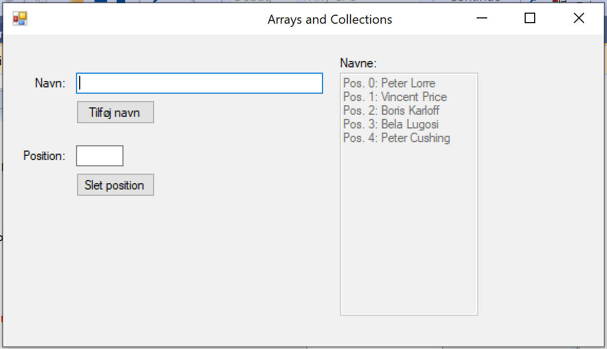

# Afleveringsopgave 1

Navneliste

Lav en winforms* applikation ala den der kan ses ovenfor, der kan vise en liste af navne, f.eks. på fodboldklubber. Brugeren skal kunne indtaste disse navne, hvorefter de skal vises på en liste (Hvis du mangler ideer til en god liste, så kan ChatGPT hjælpe dig)

- [x] Som datatype skal benyttes Arrays.
- [x] Enten skal array'et have plads til præcis 10 navne, eller også skal applikationen håndtere at array'et kan blive resized.
- [x] Gør brug af egne metoder i den udstrækning du mener det er nødvendigt.
- [x] Det skal være muligt via formen at kunne tilføje et nyt navn til listen og derefter få opdateret listen.
- [x] Via formen skal det være muligt at kunne fjerne et navn fra listen ved at angive hvilken position i listen man gerne vil fjernet.
- [x] Din applikationen skal kunne håndtere, hvis brugeren forsøger at oprette et navn, men ikke har indtastet noget i feltet. Vi kommer nærmere ind på fejlhåndtering i uge 7, derfor behøver du ikke tænke meget over fejlhåndtering i denne applikation.

## Opgave til dem der vil mere 1

- [x] I stedet for at fjerne navne fra listen ved at angive en position, skal man kunne vælge et navn på listen og trykke på en "Delete" knap.

## Opgave til dem der vil mere 2

Vi kigger først på forskellige sorteringsmuligheder i uge 10, men hvis du har modet på det, så prøve at ændre din kode sådan:

- [x]  At når listen vises på formen, skal den altid være sorteret alfabetisk.
- [x]  Det skal dog være muligt via formen at kunne ændre i sorteringen sådan at listen vises i omvendt alfabetisk orden.
- [x] For denne opgave, skal du implementere 2 nye knapper: 1 der sortere alfabetisk og 1 der sortere omvendt alfabetisk.

## Opgave til dem der vil mere 3

- [x]  I stedet for at benytte Arrays som datastruktur, så vælg en anden type Collection vi har kigget på, og omskriv din applikation til at benytte denne Collection type.

## Aflevering

Du kan aflevere på to måder:

1. Aflevering som zip-fil
2. Aflevering i Github

Begge dele er beskrevet i Informationshjørnet.

I rapporten skal du huske at begrunde evt. valg du har foretaget. F.eks. dine overvejelser omkring brugen af egne metoder.
Der er hjælp, hvis du kører fast i opgaven. Brug underviseren flittigt ved at sende en besked til ham eller anvend fora. Fordelen med fora (spørgsmål til underviser og studerende) er at der normalt er større chance for at få hurtig hjælp fra en medstuderende også.
