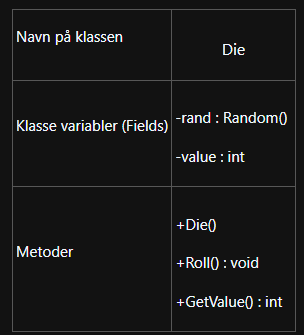
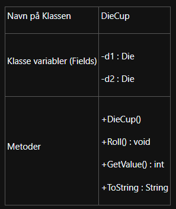
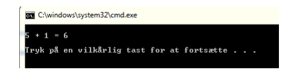

# Opgave: Terninger og raflebægre

## Del 1
I denne opgave, skal du oprette en klasse, der repræsenterer en almindelig 6-sidet terning.

1. Opret et nyt projekt og navngiv det: Terning- og raflebægre øvelse

2. Opret klassen Die jf. nedenstående UML diagram 

3. Klassen har følgende fields:
   1. value, der indeholder værdien af det sidste slag
   2. rand, der er et Objekt af typen Random. Variablen erklæres på flg. måde: static Random rand;

4. Klassen skal have en constructor, der ikke tager parametre. Constructor’en skal initialisere value og rand.
   1. Bemærk, at rand er et objekt af typen Random og skal initialiseres ved rand = new Random();

5. Klassen har to metoder:
   1. GetValue(), der returnerer værdien af variablen value. 
   2. Roll(), der slår et slag med terningen og gemmer værdien i value. For at generere et tilfældigt tal mellem 1 og 6 anvendes nedenstående kode:
value = rand.next(1, 7);

6. I din Main metode, skal du oprette et objekt af Die klassen og afprøve metoderne Roll() og GetValue().

Bliver der genereret et tilfældigt tal, hver gang du kører programmet?

## Del 2

I denne opgave, skal du oprette en klasse, der repræsenterer et raflebæger

7. Du skal benytte projektet fra del 1

8. Opret klassen DieCup jf. nedenstående UML diagram 

9. Klassen har følgende fields:
   1.  d1 & d2, der er objekter af typen Die.

10. Klassen skal have en constructor, der ikke tager parametre. Constructor’en skal initialisere d1 og d2.

11. Klassen har tre metoder:
    1.  GetValue(), der returnerer den samlede værdi fra begge terninger.
    2.  Roll(), der slår et slag med begge terninger
    3.  ToString(), skal returnere en streng, der viser værdien af begge terninger samt deres sum.

12.  I din Main metode, skal du oprette et objekt af DieCup klassen og afprøve metoderne Roll(), GetValue() og ToString(). Bliver der genereret tilfældige tal, hver gang du kører programmet?

13.  EKSTRA OPGAVE. Du skal modificere klassen Die, så man kan oprette en terning med forskellige sider – f.eks. en 10- sidet terning eller en 20-sidet terning. Modificer herefter DieCup klassen, så den opretter to terninger med forskelligt antal sider.

Afprøv derefter din løsning.